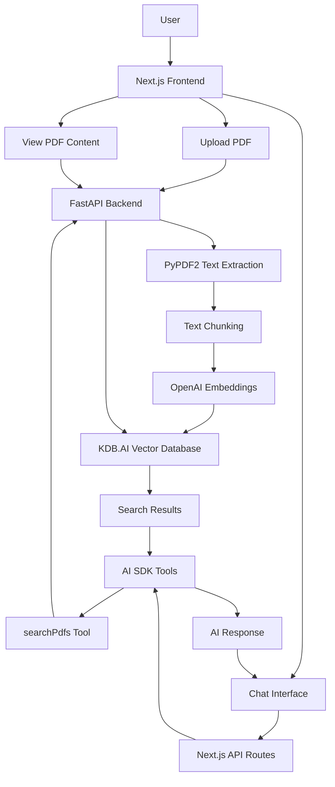

# PDF Chat with KDB.AI

<p align="center">
  
  <h3 align="center">Chat with your PDFs using AI and vector search</h3>
</p>

<p align="center">Built on the <a href="https://github.com/digitros/nextjs-fastapi">Next.js FastAPI Starter</a> template, deployable as a single application on Vercel.</p>

## Introduction

This application allows users to upload PDFs, process them into searchable chunks, and chat with their documents using AI. It combines Next.js for the frontend with Python's AI capabilities on the backend, all deployable as a single application on Vercel.

## Key Features

- **PDF Processing**: Upload and process PDFs using PyPDF2
- **Vector Search**: Store and query document chunks using KDB.AI vector database
- **AI Chat**: Interact with your documents using natural language
- **Single Deployment**: Deploy both frontend and backend on Vercel
- **No Login Required**: Uses fingerprinting for anonymous user identification
- **AI SDK Tool Calling**: Uses Vercel's AI SDK for structured tool execution

## Architecture

The application consists of:

1. **Next.js Frontend**: Handles UI and user interactions
2. **FastAPI Backend**: Processes PDFs and manages vector database operations
3. **KDB.AI**: Vector database for semantic search
4. **OpenAI**: Provides embeddings and AI capabilities
5. **Vercel AI SDK**: Manages tool calling and AI interactions



## How It Works

### PDF Processing Flow

1. User uploads PDFs through the UI
2. FastAPI backend extracts text using PyPDF2
3. Text is split into manageable chunks
4. OpenAI generates embeddings for each chunk
5. Chunks and embeddings are stored in KDB.AI vector database

### Chat Flow

1. User asks a question about their documents
2. AI uses the `searchPdfs` tool to find relevant information
3. The tool queries KDB.AI for semantically similar content
4. Results are formatted and returned to the AI
5. AI generates a response based on the retrieved information

### AI SDK Tool Calling

This application leverages [Vercel's AI SDK tool calling](https://sdk.vercel.ai/docs/ai-sdk-core/tools-and-tool-calling) functionality to enable structured interactions between the AI and the vector database. The main tool used is:

```typescript
searchPdfs: tool({
  description: 'Search for information in the user's PDF documents',
  parameters: z.object({
    query: z.string().describe('The search query to find information in PDFs'),
    pdfIds: z.array(z.string()).optional().describe('Optional specific PDF IDs to search within'),
    searchMode: z.enum(['unified', 'individual']).optional().describe('Search mode')
  }),
  execute: async ({ query, pdfIds, searchMode = "unified" }) => {
    // Implementation that searches KDB.AI and returns formatted results
  }
})
```

The AI SDK handles:
- Tool definition with Zod schemas for type safety
- Tool execution with proper error handling
- Multi-step tool calling with `maxSteps` parameter
- Streaming of tool results back to the UI

### Deployment Architecture

This project leverages the [Next.js FastAPI Starter template](https://github.com/digitros/nextjs-fastapi), which allows for deploying both the Next.js frontend and Python/FastAPI backend as a single application on Vercel.

The Python/FastAPI server is mapped into the Next.js app under `/api/`, implemented using `next.config.js` rewrites. This architecture means you don't need to deploy the backend and frontend separately.

## Environment Setup

Create a `.env.local` file with:

```
KDBAI_ENDPOINT="your-kdb-ai-endpoint"
KDBAI_API_KEY="your-kdb-ai-api-key"
OPENAI_API_KEY="your-openai-api-key"
NEXT_PUBLIC_API_URL="http://127.0.0.1:8000"
```

## Local Development

1. Create and activate a virtual environment:
```bash
python3 -m venv venv
source venv/bin/activate  # On Windows: venv\Scripts\activate
```

2. Install dependencies:
```bash
npm install
# or
yarn
# or
pnpm install
```

3. Run the development server:
```bash
npm run dev
# or
yarn dev
# or
pnpm dev
```

This will start both the Next.js frontend and FastAPI backend. The frontend will be available at http://localhost:3000 and the API at http://127.0.0.1:8000.

## Deploy Your Own

You can clone & deploy it to Vercel with one click:

[](https://vercel.com/new/clone?repository-url=https%3A%2F%2Fgithub.com%2Fyour-username%2Fpdf-chat-kdbai)

## Learn More

- [KDB.AI](https://kdb.ai/) - Get your own KDB.AI vector database
- [KDB.AI Documentation](https://code.kx.com/kdbai/latest) - Learn about KDB.AI vector database
- [Next.js FastAPI Starter](https://github.com/digitros/nextjs-fastapi) - The template this project is based on
- [PyPDF2 Documentation](https://pypdf2.readthedocs.io/) - PDF processing library
- [OpenAI Documentation](https://platform.openai.com/docs/) - For embeddings and AI capabilities
- [Next.js Documentation](https://nextjs.org/docs) - Learn about Next.js features and API
- [FastAPI Documentation](https://fastapi.tiangolo.com/) - Learn about FastAPI features and API
- [Vercel AI SDK Tool Calling](https://sdk.vercel.ai/docs/ai-sdk-core/tools-and-tool-calling) - Learn about AI SDK tool calling

## License

This project is licensed under the MIT License - see the LICENSE file for details.
