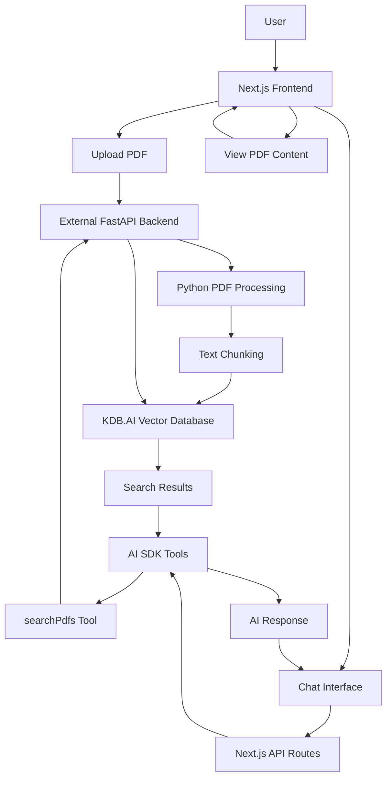

# PDF Chat with KDB.AI

<p align="center">
  
  <h3 align="center">Chat with your PDFs using AI and vector search</h3>
</p>

<p align="center">Frontend built with Next.js, connected to an external FastAPI backend. Deployed at <a href="https://pdfgpt.dev">pdfgpt.dev</a>.</p>

## Introduction

This application allows users to upload PDFs, process them into searchable chunks, and chat with their documents using AI. It combines Next.js for the frontend with an external FastAPI backend for AI capabilities and PDF processing, all deployable as a single application on Vercel.

## Key Features

- **Python-based PDF Processing**: Upload PDFs to a dedicated FastAPI backend for high-quality parsing
- **Vector Search**: Store and query document chunks using KDB.AI vector database
- **AI Chat**: Interact with your documents using natural language
- **External API Integration**: Connect to the FastAPI backend hosted at pdfchat.replit.app
- **No Login Required**: Uses fingerprinting for anonymous user identification
- **AI SDK Tool Calling**: Uses Vercel's AI SDK for structured tool execution

## Architecture

The application consists of:

1. **Next.js Frontend**: Handles UI and user interactions
2. **External FastAPI Backend**: Manages PDF processing, vector database operations, and AI search (a Python backend hosted at https://replit.com/@MichaelR35/KDBAI-PDF-ChatBot-Backend)
3. **KDB.AI**: Vector database for semantic search
4. **OpenAI**: Provides embeddings and AI capabilities
5. **Vercel AI SDK**: Manages tool calling and AI interactions



## How It Works

### PDF Processing Flow

1. User uploads PDFs through the UI
2. PDFs are sent directly to the FastAPI backend
3. The backend processes PDFs using Python-based libraries (PyPDF via LangChain)
4. Text is extracted and split into manageable chunks
5. The backend generates embeddings using OpenAI
6. Chunks and embeddings are stored in KDB.AI vector database

### Chat Flow

1. User asks a question about their documents
2. AI uses the `searchPdfs` tool to find relevant information
3. The tool queries the external API, which searches KDB.AI for semantically similar content
4. Results are formatted and returned to the AI
5. AI generates a response based on the retrieved information

### AI SDK Tool Calling

This application leverages [Vercel's AI SDK tool calling](https://sdk.vercel.ai/docs/ai-sdk-core/tools-and-tool-calling) functionality to enable structured interactions between the AI and the vector database. The main tool used is:

```typescript
searchPdfs: tool({
  description: 'Search for information in the user's PDF documents',
  parameters: z.object({
    query: z.string().describe('The search query to find information in PDFs'),
    pdfIds: z.array(z.string()).optional().describe('Optional specific PDF IDs to search within'),
    searchMode: z.enum(['unified', 'individual']).optional().describe('Search mode')
  }),
  execute: async ({ query, pdfIds, searchMode = "unified" }) => {
    // Implementation that searches through the external API
  }
})
```

The AI SDK handles:
- Tool definition with Zod schemas for type safety
- Tool execution with proper error handling
- Multi-step tool calling with `maxSteps` parameter
- Streaming of tool results back to the UI

### Deployment Architecture

This project now connects to an external FastAPI backend hosted at pdfchat.replit.app, which means:
1. The frontend can be deployed as a standalone Next.js application
2. The backend handles all PDF processing, eliminating client-side and serverless limitations
3. Better quality PDF parsing using Python-based tools
4. No serverless function limits for PDF size or processing time

## Environment Setup

Create a `.env.local` file with:

```
KDBAI_ENDPOINT="your-kdb-ai-endpoint"
KDBAI_API_KEY="your-kdb-ai-api-key"
OPENAI_API_KEY="your-openai-api-key"
```

## Local Development

Install dependencies:
```bash
npm install
# or
yarn
# or
pnpm install
```

Run the development server:
```bash
npm run dev
# or
yarn dev
# or
pnpm dev
```

This will start the Next.js frontend. The API calls will use the external backend at pdfchat.replit.app for PDF processing and vector operations.

## Deploy Your Own

You can clone & deploy it to Vercel with one click:

[](https://vercel.com/new/clone?repository-url=https%3A%2F%2Fgithub.com%2Fyour-username%2Fpdf-chat-kdbai)

## Learn More

- [KDB.AI](https://kdb.ai/) - Get your own KDB.AI vector database
- [KDB.AI Documentation](https://code.kx.com/kdbai/latest) - Learn about KDB.AI vector database
- [OpenAI Documentation](https://platform.openai.com/docs/) - For embeddings and AI capabilities
- [Next.js Documentation](https://nextjs.org/docs) - Learn about Next.js features and API
- [FastAPI Documentation](https://fastapi.tiangolo.com/) - Learn about FastAPI features and API
- [Vercel AI SDK Tool Calling](https://sdk.vercel.ai/docs/ai-sdk-core/tools-and-tool-calling) - Learn about AI SDK tool calling

## License

This project is licensed under the MIT License - see the LICENSE file for details.
